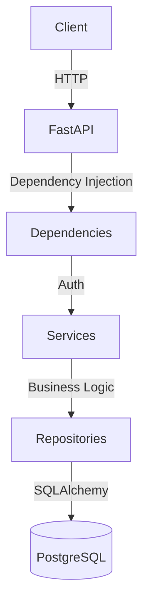

# Expense Tracker


A production-grade, full-stack personal finance application designed to help users track expenses, manage income streams, set dynamic budgets, and visualize their financial health through comprehensive reports.

Built with a **FastAPI** backend and a **React** frontend, the application enforces clean architecture principles and robust security standards.

---

## 🚀 Features

- **Robust Authentication:** Secure JWT bearer token authentication with refresh token flows and bcrypt password hashing.
- **Comprehensive Expense & Income Management:** Full CRUD operations with advanced filtering, sorting, pagination, and detailed notes.
- **Dynamic Budgets:** Set specific budgets per category for any given month, with visual progress bars to track spending against limits.
- **Advanced Categorization:** Organize finances effortlessly with per-user custom categories and sensible defaults on registration.
- **Interactive Dashboard & Reports:** Visualize your all-time summary, monthly breakdowns, and category-level spending trends via Recharts.
- **Data Export:** Easily export filtered expense and income reports to CSV for external analysis.
- **Responsive Modern UI:** A sleek, fully responsive single-page application built with React, Vite, and TailwindCSS (including full dark mode support).
- **Containerized Deployment:** Run the complete stack (API, Frontend, and PostgreSQL) effortlessly using Docker Compose.

---

## 🏗️ Architecture overview

The application follows a clean, layered architecture ensuring separation of concerns:



### Backend Layers
- **`api/v1/`**: Routing, HTTP request parsing, and response shaping.
- **`services/`**: Core business logic, validation, and entity ownership enforcement.
- **`repositories/`**: Database interactions and SQL queries via SQLAlchemy.
- **`models/`**: SQLAlchemy ORM entity definitions.
- **`schemas/`**: Pydantic v2 schemas for strict I/O validation.

---

## 🛠️ Technology Stack

**Backend**
* **Python 3.12+**
* **FastAPI 0.115** — High-performance async REST framework
* **SQLAlchemy 2.x** — Async ORM with `asyncpg`
* **PostgreSQL 16** — Robust relational database
* **Pydantic v2 & Alembic** — Validation and schema migrations
* **Pytest** — Comprehensive unit and integration testing

**Frontend**
* **React 18 & Vite** — Next-generation frontend tooling
* **TailwindCSS** — Utility-first styling framework
* **Recharts** — Declarative charting library
* **Axios** — HTTP client configured with automated token refresh

---

## 🔧 Getting Started

### Prerequisites
- [Docker](https://docs.docker.com/get-docker/) & [Docker Compose](https://docs.docker.com/compose/install/)

### Docker Deployment

1. **Clone the repository:**
   ```bash
   git clone https://github.com/your-username/expense-tracker.git
   cd expense-tracker
   ```

2. **Configure environment variables:**
   ```bash
   cp .env.example .env
   ```
   *Edit `.env` to securely set your `JWT_SECRET_KEY` and database credentials.*

3. **Launch the application:**
   ```bash
   docker compose up -d --build
   ```

The application will be available at:
- **Frontend:** http://localhost:3000
- **API Documentation:** http://localhost:8000/docs
- **API Backend:** http://localhost:8000

---

## 💻 Local Development

To run the application locally without Docker:

**1. Backend Setup**
```bash
python -m venv .venv
source .venv/bin/activate  # On Windows: .venv\Scripts\activate
pip install -e ".[dev]"

# Configure DATABASE_URL in your .env to point to a local PostgreSQL instance
alembic upgrade head
uvicorn app.main:app --reload
```

**2. Frontend Setup**
```bash
cd frontend
npm install
npm run dev
```

---

## 🧪 Testing

The backend test suite runs securely using an in-memory SQLite database.

```bash
# Ensure dev dependencies are installed
pip install -e ".[dev]" aiosqlite

# Run the complete test suite
pytest

# Generate coverage report
pytest --cov=app --cov-report=html
```

---

## 🔒 Security Posture

- **Password Security:** Hashes are generated via `bcrypt` and never exposed to the client.
- **Token Lifecycles:** Configurable JWT expiration to minimize session hijacking windows.
- **Data Isolation:** All database queries are scoped to the authenticated user ID at the repository level.
- **Secret Management:** Strict dependency on environment variables to prevent accidental credential commits.
- **Error Handling:** Internal server errors and tracebacks are intercepted and sanitized before reaching the client.

---

## 📄 License

This project is licensed under the MIT License - see the [LICENSE](LICENSE) file for details.
