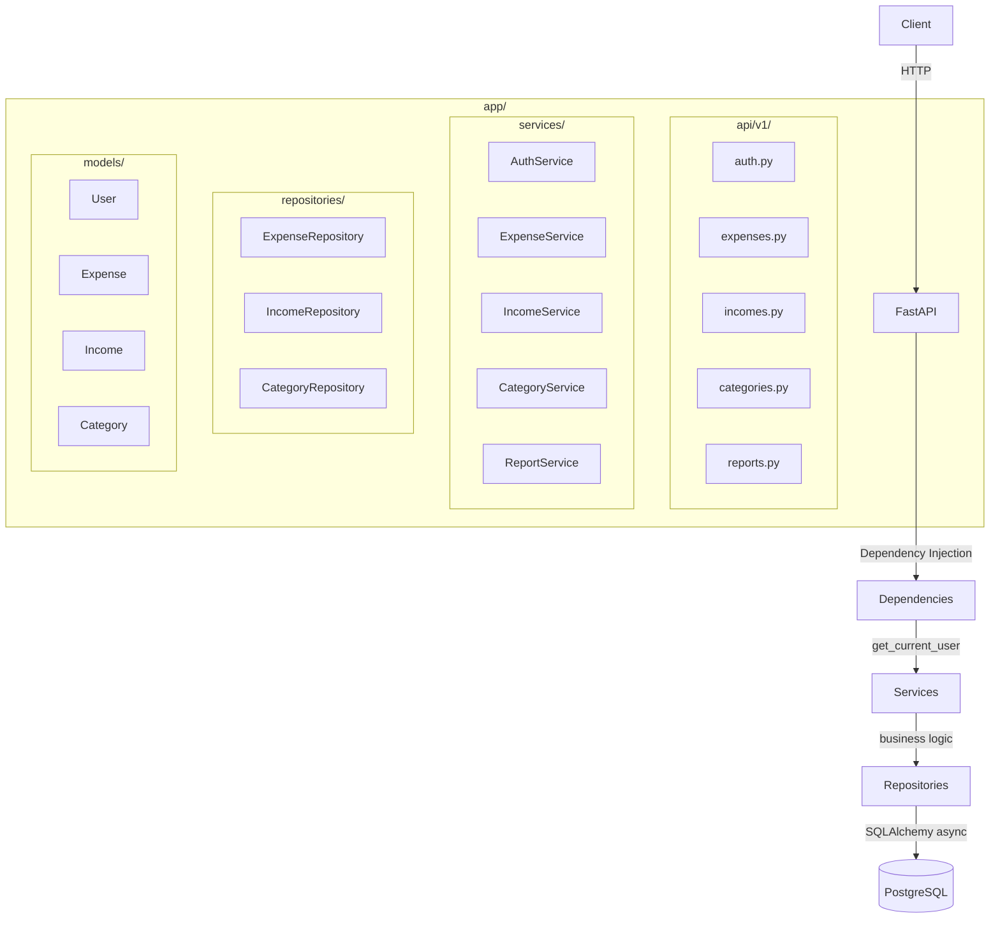

# 💰 Expense Tracker API

A **production-grade personal finance REST API** built with FastAPI, SQLAlchemy 2.x, PostgreSQL, and Docker. Tracks expenses, income, categories, and generates financial reports — designed with clean architecture and security in mind.

---

## ✨ Features

| Feature | Details |
|---------|---------|
| 🔐 Authentication | JWT bearer tokens, bcrypt password hashing |
| 💸 Expense Management | Full CRUD with filtering, sorting, pagination |
| 💼 Income Tracking | Add and manage income sources |
| 🏷️ Categories | Per-user categories with 10 defaults on signup |
| 📊 Dashboard | Totals, balance, largest/average expense |
| 📅 Monthly Reports | Income vs expenses breakdown by category |
| 🔍 Filtering | Category, date range, amount range, payment method |
| 🐳 Docker | Single `docker compose up --build` to run |
| ✅ Tests | Unit + integration with SQLite in-memory |

---

## 🏛️ Architecture



### Layer Responsibilities

| Layer | Responsibility |
|-------|---------------|
| `api/v1/` | HTTP binding, request parsing, response shaping |
| `services/` | Business logic, ownership enforcement, validation |
| `repositories/` | All SQL queries — no logic in the ORM layer |
| `models/` | SQLAlchemy ORM declarations |
| `schemas/` | Pydantic v2 request/response models |
| `core/` | Config, database engine, security, exceptions |
| `dependencies/` | FastAPI DI — JWT auth resolver |

---

## 🗄️ Database Design

```
users
 ├── id, email (unique), full_name, hashed_password, is_active
 ├── created_at, updated_at
 │
 ├── categories (user_id FK)
 │    └── id, name, user_id  [unique per user]
 │
 ├── expenses (user_id FK, category_id FK → SET NULL)
 │    └── id, title, description, amount, currency, expense_date,
 │        payment_method, notes, category_id, user_id
 │
 └── incomes (user_id FK)
      └── id, source, amount, currency, income_date, description
```

**Indexes**: composite indexes on `(user_id, expense_date)` and `(user_id, category_id)` for efficient per-user range queries.

---

## 🛠️ Technology Stack

- **Python 3.12+**
- **FastAPI 0.115** — async REST framework
- **SQLAlchemy 2.x** — async ORM with `asyncpg`
- **Pydantic v2** — runtime validation and serialization
- **Alembic** — schema migrations
- **PostgreSQL 16** — primary database
- **python-jose** — JWT tokens
- **passlib + bcrypt** — password hashing
- **pytest + httpx** — async testing
- **Ruff** — linting and formatting
- **Docker + Docker Compose** — containerization

---

## 📡 API Endpoints

### Authentication
```
POST   /api/v1/auth/register     Register a new user
POST   /api/v1/auth/login        Obtain a JWT token
GET    /api/v1/auth/me           Get current user profile
```

### Expenses
```
GET    /api/v1/expenses          List (filtered, sorted, paginated)
POST   /api/v1/expenses          Create an expense
GET    /api/v1/expenses/{id}     Get a single expense
PATCH  /api/v1/expenses/{id}     Update an expense
DELETE /api/v1/expenses/{id}     Delete an expense
```

#### Expense Query Parameters
| Param | Type | Description |
|-------|------|-------------|
| `category_id` | int | Filter by category |
| `date_from` | date | On or after |
| `date_to` | date | On or before |
| `min_amount` | decimal | Minimum amount |
| `max_amount` | decimal | Maximum amount |
| `payment_method` | string | `cash`, `credit_card`, `debit_card`, etc. |
| `sort_by` | string | `expense_date`, `amount`, `created_at` |
| `sort_order` | string | `asc` or `desc` |
| `page` | int | Page number |
| `page_size` | int | Items per page (max 100) |

### Categories
```
GET    /api/v1/categories         List categories
POST   /api/v1/categories         Create category
PATCH  /api/v1/categories/{id}    Rename category
DELETE /api/v1/categories/{id}    Delete (fails if expenses linked)
```

### Incomes
```
GET    /api/v1/incomes            List incomes (paginated)
POST   /api/v1/incomes            Add income
GET    /api/v1/incomes/{id}       Get single income
PATCH  /api/v1/incomes/{id}       Update income
DELETE /api/v1/incomes/{id}       Delete income
```

### Reports
```
GET    /api/v1/reports/dashboard          All-time financial summary
GET    /api/v1/reports/monthly?year=&month=   Monthly breakdown
GET    /api/v1/reports/category-summary   All-time by category
```

---

## ⚙️ Environment Variables

Copy `.env.example` to `.env` and fill in your values:

| Variable | Description | Default |
|----------|-------------|---------|
| `DATABASE_URL` | Async PostgreSQL URL | (required) |
| `JWT_SECRET_KEY` | Secret for signing JWTs — keep this safe! | (required) |
| `JWT_ALGORITHM` | JWT signing algorithm | `HS256` |
| `ACCESS_TOKEN_EXPIRE_MINUTES` | Token lifetime | `30` |
| `POSTGRES_USER` | PostgreSQL username (Docker) | `postgres` |
| `POSTGRES_PASSWORD` | PostgreSQL password (Docker) | `postgres` |
| `POSTGRES_DB` | PostgreSQL database name (Docker) | `expense_tracker` |

> ⚠️ **Never commit `.env`** — it is in `.gitignore`.  
> Generate a secure key: `python -c "import secrets; print(secrets.token_hex(32))"`

---

## 🚀 Quick Start with Docker

```bash
# 1. Clone and enter the directory
git clone <your-repo> expense-tracker
cd expense-tracker

# 2. Configure environment
cp .env.example .env
# Edit .env and set a strong JWT_SECRET_KEY

# 3. Start everything
docker compose up --build

# API runs at:   http://localhost:8000
# Docs:          http://localhost:8000/docs
# ReDoc:         http://localhost:8000/redoc
```

Alembic migrations run automatically on startup.

---

## 💻 Local Development (without Docker)

```bash
# Create virtual environment
python -m venv .venv
source .venv/bin/activate  # Windows: .venv\Scripts\activate

# Install all dependencies (including dev)
pip install -e ".[dev]"

# Set DATABASE_URL to point to your local PostgreSQL
# Then run migrations:
alembic upgrade head

# Start the development server
uvicorn app.main:app --reload
```

---

## 🧪 Running Tests

Tests use **SQLite in-memory** — no PostgreSQL required locally.

```bash
# Install dev dependencies
pip install -e ".[dev]"
pip install aiosqlite

# Run all tests
pytest

# With coverage report
pytest --cov=app --cov-report=html

# Run only unit tests
pytest tests/unit/

# Run only integration tests
pytest tests/integration/
```

---

## 📝 Example API Requests

### Register & Login
```bash
# Register
curl -X POST http://localhost:8000/api/v1/auth/register \
  -H "Content-Type: application/json" \
  -d '{"email":"alice@example.com","full_name":"Alice","password":"secret123"}'

# Login → get token
curl -X POST http://localhost:8000/api/v1/auth/login \
  -H "Content-Type: application/json" \
  -d '{"email":"alice@example.com","password":"secret123"}'
```

### Create an Expense
```bash
curl -X POST http://localhost:8000/api/v1/expenses \
  -H "Authorization: Bearer <token>" \
  -H "Content-Type: application/json" \
  -d '{
    "title": "Monthly Rent",
    "amount": "1500.00",
    "currency": "USD",
    "expense_date": "2026-09-01",
    "category_id": 3,
    "payment_method": "bank_transfer"
  }'
```

### Filter Expenses
```bash
curl "http://localhost:8000/api/v1/expenses?min_amount=100&max_amount=2000&sort_by=amount&sort_order=desc&page=1&page_size=10" \
  -H "Authorization: Bearer <token>"
```

### Monthly Report
```bash
curl "http://localhost:8000/api/v1/reports/monthly?year=2026&month=9" \
  -H "Authorization: Bearer <token>"
```

---

## 🔒 Security Notes

- Passwords are hashed with **bcrypt** — never stored in plaintext
- Password hashes are **never returned** in API responses
- JWT tokens expire (default: 30 minutes)
- All expense/income/category endpoints enforce **user ownership** at the repository level
- Secrets are loaded from environment variables — **no hardcoded credentials**
- Internal exceptions are never exposed to API clients

---

## 🔮 Future Improvements

- [ ] Refresh token support
- [ ] Multi-currency conversion (via exchange rate API)
- [ ] Budget tracking and alerts
- [ ] Recurring expenses/income
- [ ] CSV/PDF export for reports
- [ ] Rate limiting middleware
- [ ] Redis caching for dashboard aggregates
- [ ] OAuth2 (Google, GitHub) social login
- [ ] Email verification on registration
- [ ] Admin panel
